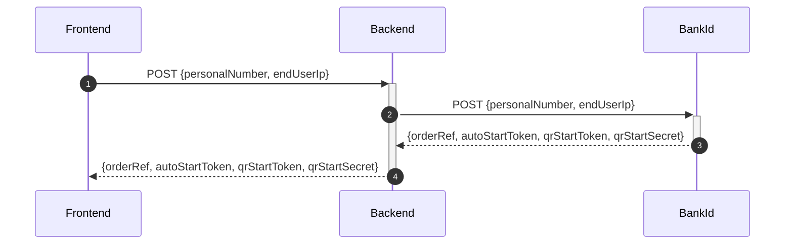
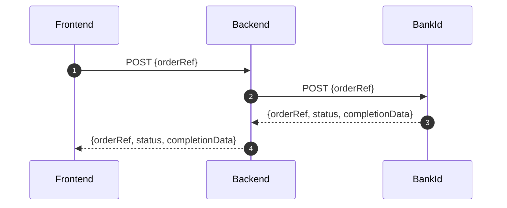
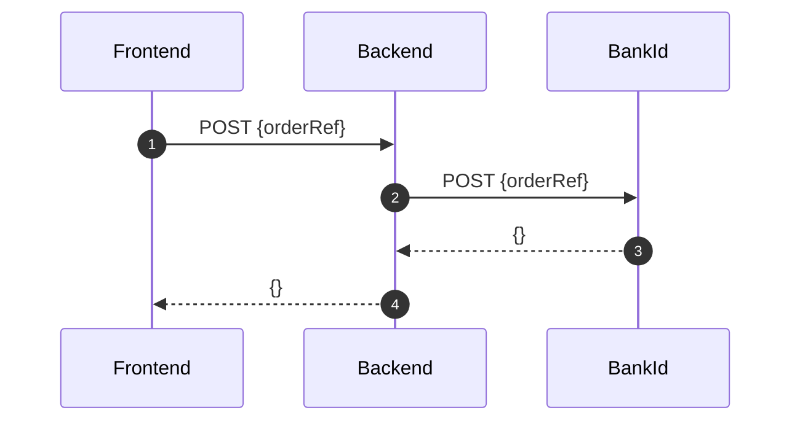
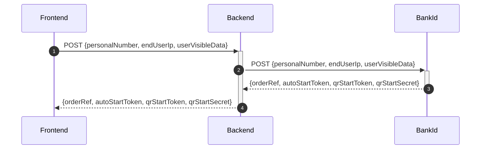

## Description

RESTful API that allows you to use the following BankId integrations: authentication, sign, collect and cancel.

Complete
documentation [BankID relying party guidelines (documentation)](https://www.bankid.com/bankid-i-dina-tjanster/rp-info).

The workflow to perform a login is as follows: you make an authentication request and then start periodically polling
against the collect end-point. This continues until the session expires, or the user cancels, or the user successfully
logs in, in which case we receive a success response.

## API

### Authentication

#### Header
`x-api-key: <api-key>`

### AUTH



#### Request type

`POST`

#### Endpoint

`/auth`

#### JSON payload

```json
{
  "personalNumber": "203010101010",
  "endUserIp": "0.0.0.0"
}
```

#### Expected response

```json
{
  "jsonapi": {
    "version": "1.0"
  },
  "data": {
    "type": "bankIdAuth",
    "attributes": {
      "orderRef": "order-reference-id",
      "autoStartToken": "auto-start-token",
      "qrStartToken": "qr-start-token",
      "qrStartSecret": "qr-start-secret"
    }
  }
}
```

---

### COLLECT



#### Request type

`POST`

#### Endpoint

`/collect`

#### JSON payload

```json
{
  "orderRef": "order-reference-id"
}
```

#### Expected response

Pending

```json
{
  "jsonapi": {
    "version": "1.0"
  },
  "data": {
    "type": "bankIdCollect",
    "attributes": {
      "orderRef": "order-reference-id",
      "status": "pending",
      "hintCode": "noClient"
    }
  }
}
```

Completed auth

```json
{
  "jsonapi": {
    "version": "1.0"
  },
  "data": {
    "orderRef": "some-ref",
    "status": "complete",
    "completionData": {
      "user": {
        "personalNumber": "190000000000",
        "name": "Karl Karlsson",
        "givenName": "Karl",
        "surname": "Karlsson"
      },
      "device": {
        "ipAddress": "192.168.0.1"
      },
      "cert": {
        "notBefore": "1502983274000",
        "notAfter": "1563549674000"
      },
      "signature": "<base64-encoded>",
      "ocspResponse": "<base64-encoded>"
    }
  }
}
```

---

### CANCEL



#### Request type

`POST`

#### Endpoint

`/cancel`

#### JSON payload

```json
{
  "orderRef": "order-reference-id"
}
```

#### Expected response

200

---

### SIGN



#### Request type

`POST`

#### Endpoint

`/sign`

#### JSON payload

```json
{
  "personalNumber": "190101010101",
  "endUserIp": "0.0.0.0",
  "userVisibleData": "example-message"
}
```

#### Expected response

```json
{
  "jsonapi": {
    "version": "1.0"
  },
  "data": {
    "type": "bankIdSign",
    "attributes": {
      "orderRef": "order-reference-id",
      "autoStartToken": "auto-start-token",
      "qrStartToken": "qr-start-token",
      "qrStartSecret": "qr-start-secret"
    }
  }
}
```
